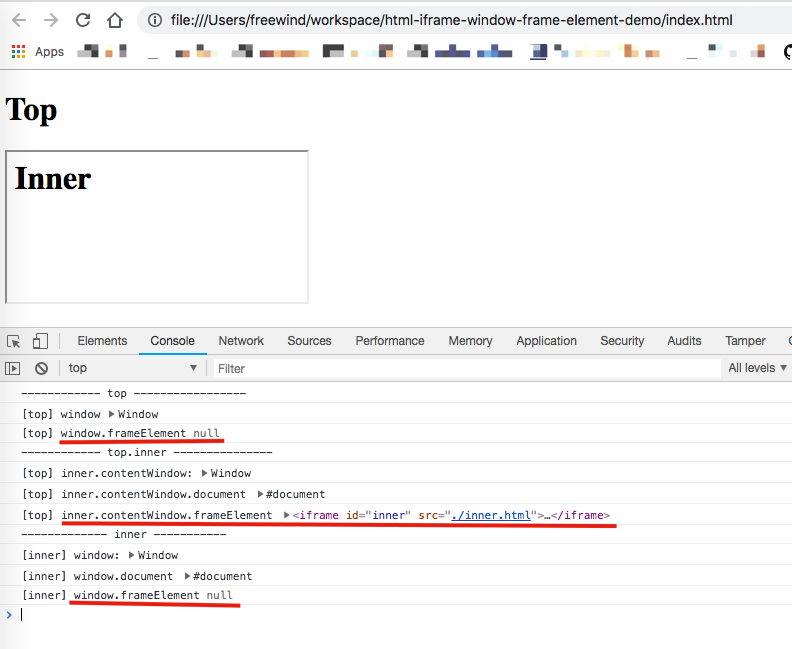
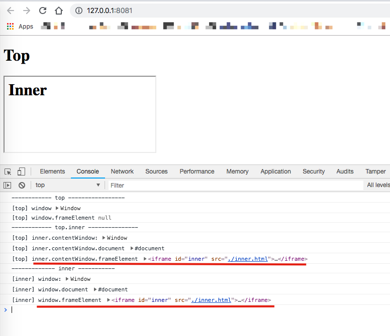

Html IFrame Content Window Demo
===============================

关于`.frameElement`是否有值，是一个比较坑的问题，它由多种因素决定：

1. 最外层的window是没有`frameElement`的
2. 对于iframe内层的window，
   1. 如果是通过从外层window以`document.querySelector('iframe')`的形式拿到的iframe element的`contentWindow`，
它始终有`frameElement`
   2. 如果是从内层window直接访问`.frameElement`，
      1. 当以本地文件形式访问时，其值为null
      2. 以http形式访问时，其值为相应的frame

```
npm install
npm run file
```



```
npm run demo
```


