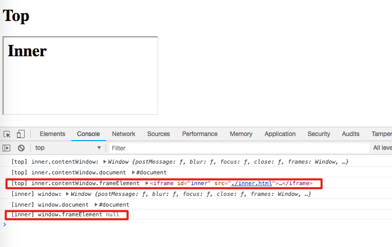

Html IFrame Content Window Demo
===============================

只有通过从外层window以`document.querySelector('iframe')`的形式拿到的iframe element的`contentWindow`，
才有`frameElement`。

如果直接是在iframe所引用的html中，只能拿到`window`（而不是`contentWindow`），它的frameElement总是`null`的。

```
open index.html
```


